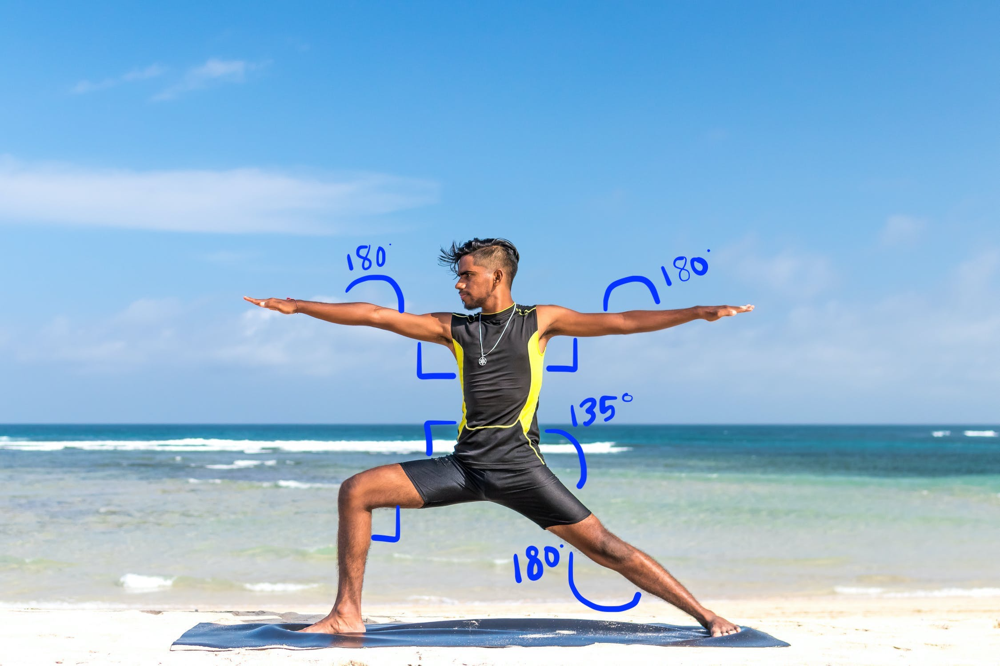

# Exercise Pose Detection & Repetition Counting

Recognizes 13 exercises and yoga poses from a single ordinary camera and counts repetitions in real time, using only **joint angles** computed from [MediaPipe Pose](https://github.com/google-ai-edge/mediapipe) landmarks: no model training, no depth sensor, no wearables.

This repository holds the research prototype (Jupyter notebooks) for:

> **System and Method for Detecting Exercise Poses and Counting Repetitions Based on Joint Angles**<br>
> Indian patent application No. **202541010885** · Applicant: International Institute of Information Technology, Hyderabad (IIIT-H)<br>
> Inventors: Charu Sharma, Kunal Kamalkishor Bhosikar, Mahika Jain, Vanshita Mahajan

## How it works

1. **Detect landmarks.** MediaPipe Pose localizes the person and returns 33 body landmarks per frame.
2. **Compute joint angles.** For landmarks A–B–C, the angle at B is `atan2(C − B) − atan2(A − B)` (in degrees, folded into 0–180°). Elbows, shoulders, hips and knees are measured on both sides of the body.
3. **Classify the pose.** Each exercise is a set of allowed angle ranges ("posing thresholds"). For example, Warrior II means both elbows ≈ 180°, both shoulders ≈ 90°, one knee straight and the other bent at 90–120°.
4. **Count repetitions.** For dynamic exercises, one rep is a full pass below a "down" angle and back above an "up" angle ("repetition thresholds"). The counter resets when the detected exercise changes.
5. **Give feedback.** The skeleton, exercise name and rep count are drawn on the live video.

<p align="center">
  
  
</p>

## Supported exercises

| Exercise | Joint angles checked | Classified in | Rep-counting rule (Part 2) |
|---|---|---|---|
| Warrior II | elbows, shoulders, knees | Parts 1 & 2 | — |
| T Pose | elbows, shoulders, hips, knees | Parts 1 & 2 | — |
| Tree Pose | elbows, knees | Parts 1 & 2 | — |
| Triangle Pose | elbows, shoulders, hips, knees | Parts 1 & 2 | — |
| Plow Pose | elbows, shoulders, hips, knees | Parts 1 & 2 | — |
| Downward Facing Dog | elbows, shoulders, hips, knees | Parts 1 & 2 | — |
| Bridge Pose | elbows, shoulders, knees | Parts 1 & 2 | — |
| Camel Pose | elbows, shoulders, hips, knees | Parts 1 & 2 | — |
| Crunches | shoulders, hips, knees | Parts 1 & 2 | — |
| V-sit | elbows, shoulders, knees | Part 1 only | — |
| Squat | shoulders, hips, knees | Parts 1 & 2 | mean hip angle drops below 100°, then rises above 160° |
| Push-Ups | elbows, hips, knees | Part 2 only | mean elbow angle drops below 90°, then rises above 100° |
| Lunges | elbows, knees | Parts 1 & 2 | one knee below 70° while the other is above 140° |

## Repository structure

```text
.
├── PoseEstimationandCorrection.ipynb   # Part 1: detection, joint angles, pose classification on images
├── PoseDetectionCounting.ipynb         # Part 2: refined classifier + real-time rep counting (webcam)
├── media/     # test photos for each exercise + sample videos (running.mp4, exercising.mp4)
└── images/    # explanatory diagrams (landmark map, detector→tracker pipeline, joint angle, Warrior II)
```

## Notebooks

**Part 1: [`PoseEstimationandCorrection.ipynb`](PoseEstimationandCorrection.ipynb)**
- Sets up MediaPipe Pose and shows landmark detection on sample photos, including a 3D plot of the world landmarks.
- Runs live detection on a webcam (or a video file) with an FPS counter.
- Defines `calculateAngle()` and the rule-based `classifyPose()`, then tests every exercise on sample images. The joint angles behind each decision are printed.

**Part 2: [`PoseDetectionCounting.ipynb`](PoseDetectionCounting.ipynb)**
- Refines the classifier: adds Push-Ups, widens the Lunge and Squat ranges, and disables V-sit. It also tracks when the detected exercise changes.
- Adds `count_reps()`, which applies the repetition thresholds for Squat, Push-Ups and Lunges.
- The last cell is the real-time demo. It shows the webcam feed with the pose label and a `Reps: N` counter, and resets the counter whenever the exercise changes.

## Getting started

Requires **Python 3.9–3.12** (MediaPipe 0.10.21 has no wheels for 3.13+). The live demos also need a webcam.

```bash
python -m venv .venv
source .venv/bin/activate            # Windows: .venv\Scripts\activate
pip install "mediapipe==0.10.21" jupyter
jupyter notebook                     # launch from the repository root
```

With conda, create the environment with `conda create -n exercise-pose python=3.11 -y && conda activate exercise-pose`, then run the same `pip install` line.

MediaPipe is pinned because the notebooks use its legacy `mp.solutions.pose` API. With 0.10.21, Part 1's image cells reproduce the saved joint angles exactly.

### Running the notebooks

- **Launch Jupyter from the repository root.** Images are loaded with relative paths such as `media/sample1.jpg`.
- **Skip the `!pip3 install mediapipe` cell** at the top of each notebook if you installed the requirements above.
- **Webcam cells** open an OpenCV window; press **Esc** to close it. The detection demos use `cv2.VideoCapture(1)` and the rep-counting demo uses `cv2.VideoCapture(0)`. If no video appears, change the index (a laptop's built-in camera is usually `0`). To use a recorded video instead, pass a file path such as `'media/running.mp4'`.
- **Part 2 single-image cells:** Part 2's `classifyPose()` reads the globals `current_pose` and `rep_count`, which are only created in the final webcam cell. Run this once before the single-image cells:

  ```python
  current_pose, rep_count = None, 0
  ```

## Limitations

- Angles are measured on 2D image coordinates, so they depend on the camera viewpoint. The rules work best with the whole body in frame, framed like the sample photos.
- Thresholds are fixed, hand-tuned ranges. Widening them makes the rules more tolerant but increases false positives.

## Acknowledgements

- Pose estimation uses [MediaPipe Pose](https://github.com/google-ai-edge/mediapipe) by Google.
- The detection and angle scaffolding (`detectPose`, `calculateAngle`, and the first Warrior II / T / Tree rules) and much of Part 1's explanatory text are adapted from Bleed AI's tutorial [Real-Time 3D Pose Detection & Pose Classification with Mediapipe and Python](https://bleedaiacademy.com/introduction-to-pose-detection-and-basic-pose-classification/) by Taha Anwar and Rizwan Naeem.
- The diagrams in `images/` come from the MediaPipe documentation and the Bleed AI tutorial.
- Photos and videos in `media/` are third-party material used for testing only; all rights remain with their owners.
